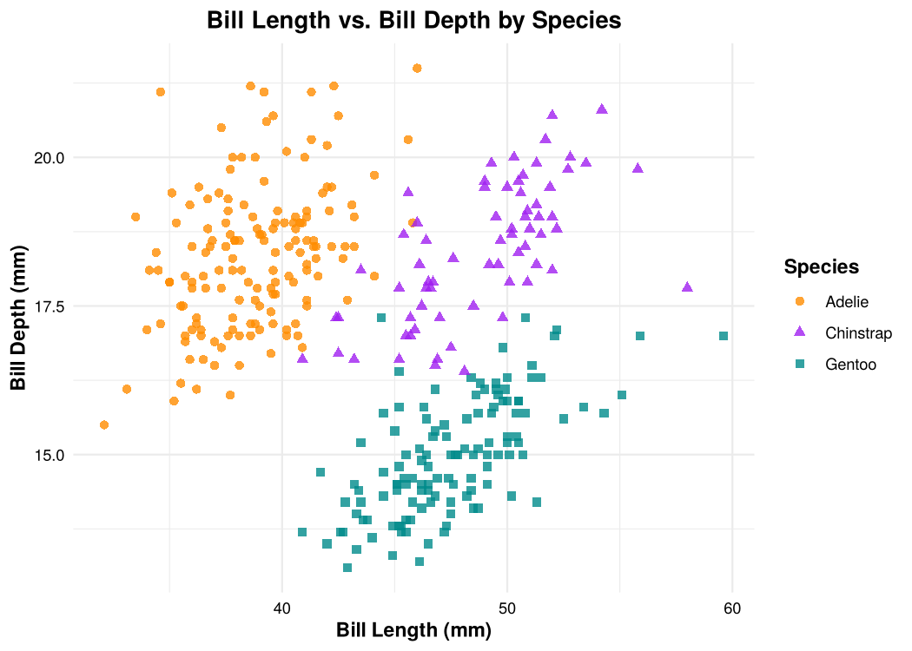

# Summary Statistics & Distributions - Palmer Penguins Species Comparison

This analysis uses size measurements for 344 adult penguins (152 Adélie, 68 Chinstrap, 124 Gentoo) collected in the Palmer Archipelago, Antarctica, from 2007 to 2009 (Gorman, Williams & Fraser, 2014), available through the `palmerpenguins` package in R. The goal is to describe how the three species differ in body size and to examine the distributions of, and relationships between, their bill and flipper measurements.

The analysis covers:

* Descriptive statistics by species: sample size, percent male, mean bill length (mm and inches), and mean, standard deviation, and maximum flipper length
* Distributions and relationships: bill depth histogram, flipper length vs. bill depth, and bill length vs. bill depth by species and by sex

  

## Key Findings

* Gentoo penguins have by far the longest flippers (mean 217.2 mm vs. 190.0 mm for Adélie and 195.8 mm for Chinstrap; maximum 231 mm). The standard deviation within each species (6.5–7.1 mm) is about half of the overall standard deviation (14.1 mm), so species accounts for much of the variation in flipper length
* The average bill length is 43.92 mm (1.73 in). Adélie penguins have the shortest bills (38.79 mm, 1.53 in), while Chinstrap (48.83 mm, 1.92 in) and Gentoo (47.50 mm, 1.87 in) have similar, longer bills
* Bill depth is bimodal: Gentoo bills are much shallower (mean 14.98 mm) than Adélie (18.35 mm) and Chinstrap (18.42 mm) bills, which overlap almost completely
* Bill length and bill depth are weakly negatively correlated across all penguins (r = -0.24) but positively correlated within every species (r = 0.39 to 0.65). Pooling the species reverses the true relationship, an example of Simpson's paradox
* The sexes are roughly balanced in each species (48–50% male), and within every species males have both longer and deeper bills than females

## Tools

R / RStudio · `palmerpenguins` · `tidyverse` · `ggplot2` · `knitr`

## Files

| File | Description |
|------|-------------|
| [`penguins_summary_statistics.md`](penguins_summary_statistics.md) | Full report with code, output, tables, and all plots (renders on GitHub) |
| [`penguins_summary_statistics.Rmd`](penguins_summary_statistics.Rmd) | R Markdown source |
| [`penguins_summary_statistics.html`](penguins_summary_statistics.html) | Same report as a standalone web page (download to view) |
| [`figures/`](figures/) | All plots |

To reproduce, open `palmer-penguins-summary-statistics.Rproj` in RStudio, install the packages with `install.packages(c("tidyverse", "palmerpenguins", "knitr"))`, and knit the `.Rmd`.
