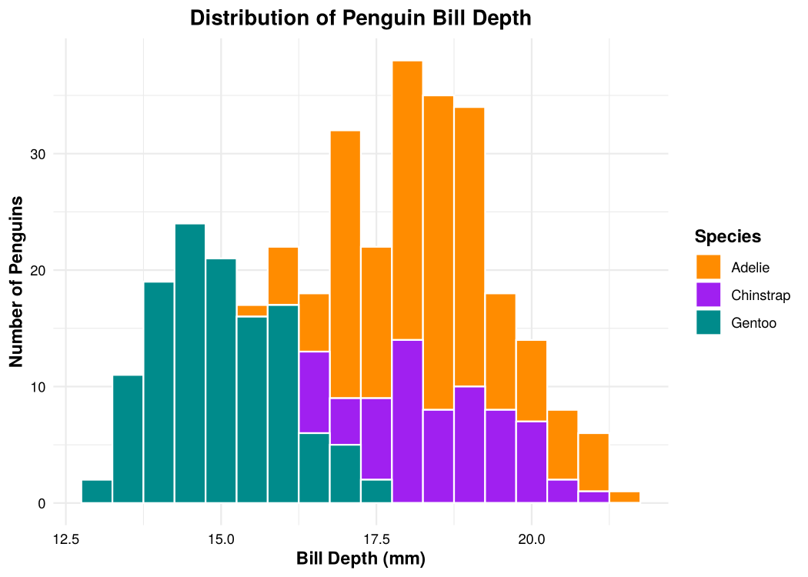
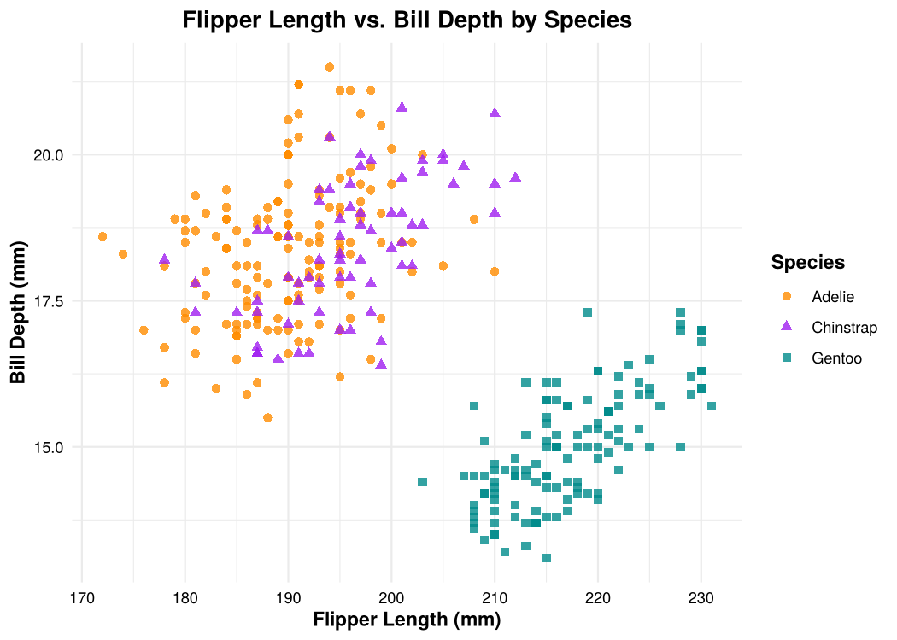
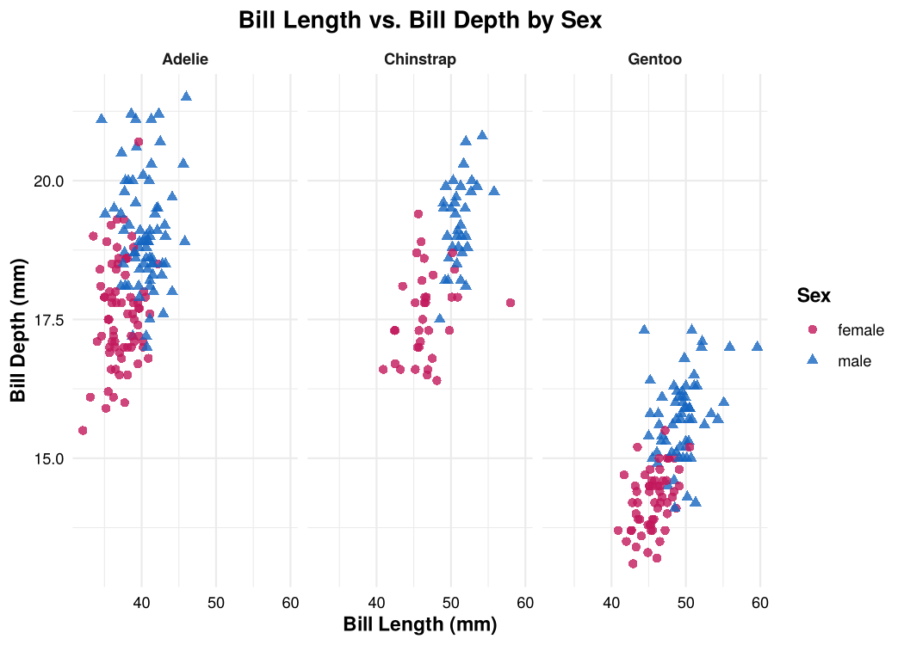

Palmer Penguins: Species Summary Statistics & Distributions
================
Joachim Vogl
2026-10-03

## Research Question

How do Adélie, Chinstrap, and Gentoo penguins differ in body size, and
what do the distributions of their bill and flipper measurements look
like?

## Data

The `penguins` dataset from the `palmerpenguins` package contains size
measurements for 344 adult penguins of three species, collected on three
islands in the Palmer Archipelago, Antarctica, from 2007 to 2009 by
Dr. Kristen Gorman and the Palmer Station Long Term Ecological Research
(LTER) program. The data were originally published in Gorman, Williams &
Fraser (2014), *PLoS ONE* 9(3): e90081.

``` r
library(tidyverse)
library(palmerpenguins)
library(knitr)

glimpse(penguins)
```

    ## Rows: 344
    ## Columns: 8
    ## $ species           <fct> Adelie, Adelie, Adelie, Adelie, Adelie, Adelie, Adel~
    ## $ island            <fct> Torgersen, Torgersen, Torgersen, Torgersen, Torgerse~
    ## $ bill_length_mm    <dbl> 39.1, 39.5, 40.3, NA, 36.7, 39.3, 38.9, 39.2, 34.1, ~
    ## $ bill_depth_mm     <dbl> 18.7, 17.4, 18.0, NA, 19.3, 20.6, 17.8, 19.6, 18.1, ~
    ## $ flipper_length_mm <int> 181, 186, 195, NA, 193, 190, 181, 195, 193, 190, 186~
    ## $ body_mass_g       <int> 3750, 3800, 3250, NA, 3450, 3650, 3625, 4675, 3475, ~
    ## $ sex               <fct> male, female, female, NA, female, male, female, male~
    ## $ year              <int> 2007, 2007, 2007, 2007, 2007, 2007, 2007, 2007, 2007~

``` r
# shared look for every plot
my_theme <- theme_minimal() +
  theme(plot.title = element_text(face = "bold", hjust = 0.5),
        axis.title = element_text(face = "bold"),
        axis.text  = element_text(color = "black"),
        legend.title = element_text(face = "bold"))

species_colors <- c(Adelie = "darkorange", Chinstrap = "purple", Gentoo = "cyan4")
```

## 1. Sample Size by Species

``` r
table(penguins$species)   # the three counts separately
```

    ## 
    ##    Adelie Chinstrap    Gentoo 
    ##       152        68       124

``` r
nrow(penguins)            # total number of penguins
```

    ## [1] 344

## 2. Bill Length

Average bill length for all penguins, then by species in millimeters and
inches (1 mm = 0.03937008 in).

``` r
mm_to_in <- 0.03937008

# all penguins
mean(penguins$bill_length_mm, na.rm = TRUE)
```

    ## [1] 43.92193

``` r
mean(penguins$bill_length_mm, na.rm = TRUE) * mm_to_in
```

    ## [1] 1.72921

``` r
# by species
penguins %>%
  group_by(species) %>%
  summarize(mean_bill_mm = mean(bill_length_mm, na.rm = TRUE)) %>%
  mutate(mean_bill_in = mean_bill_mm * mm_to_in) %>%
  kable(digits = 3,
        col.names = c("Species", "Mean bill length (mm)", "Mean bill length (in)"))
```

| Species   | Mean bill length (mm) | Mean bill length (in) |
|:----------|----------------------:|----------------------:|
| Adelie    |                38.791 |                 1.527 |
| Chinstrap |                48.834 |                 1.923 |
| Gentoo    |                47.505 |                 1.870 |

## 3. Descriptive Statistics by Species

Sample size, percent male, and flipper length statistics for each
species and for the full sample.

``` r
summarize_group <- function(df) {
  df %>%
    summarize(
      n               = n(),
      pct_male        = 100 * sum(sex == "male", na.rm = TRUE) / n(),
      mean_flipper_mm = mean(flipper_length_mm, na.rm = TRUE),
      sd_flipper_mm   = sd(flipper_length_mm, na.rm = TRUE),
      max_flipper_mm  = max(flipper_length_mm, na.rm = TRUE)
    )
}

species_stats <- penguins %>%
  group_by(species) %>%
  summarize_group() %>%
  mutate(species = as.character(species))

overall_stats <- penguins %>%
  summarize_group() %>%
  mutate(species = "All penguins")

bind_rows(species_stats, overall_stats) %>%
  kable(digits = 1,
        col.names = c("Species", "n", "% Male", "Mean flipper (mm)",
                      "SD flipper (mm)", "Max flipper (mm)"))
```

| Species      |   n | % Male | Mean flipper (mm) | SD flipper (mm) | Max flipper (mm) |
|:-------------|----:|-------:|------------------:|----------------:|-----------------:|
| Adelie       | 152 |   48.0 |             190.0 |             6.5 |              210 |
| Chinstrap    |  68 |   50.0 |             195.8 |             7.1 |              212 |
| Gentoo       | 124 |   49.2 |             217.2 |             6.5 |              231 |
| All penguins | 344 |   48.8 |             200.9 |            14.1 |              231 |

*Percent male is out of all penguins in each group; sex was not recorded
for 11 penguins (6 Adélie, 5 Gentoo).*

## 4. Distribution of Bill Depth

``` r
ggplot(penguins, aes(x = bill_depth_mm, fill = species)) +
  geom_histogram(binwidth = 0.5, color = "white") +
  scale_fill_manual(values = species_colors) +
  labs(title = "Distribution of Penguin Bill Depth",
       x = "Bill Depth (mm)",
       y = "Number of Penguins",
       fill = "Species") +
  my_theme
```

<!-- -->

``` r
penguins %>%
  group_by(species) %>%
  summarize(mean_depth_mm = mean(bill_depth_mm, na.rm = TRUE),
            sd_depth_mm   = sd(bill_depth_mm, na.rm = TRUE)) %>%
  kable(digits = 2,
        col.names = c("Species", "Mean bill depth (mm)", "SD bill depth (mm)"))
```

| Species   | Mean bill depth (mm) | SD bill depth (mm) |
|:----------|---------------------:|-------------------:|
| Adelie    |                18.35 |               1.22 |
| Chinstrap |                18.42 |               1.14 |
| Gentoo    |                14.98 |               0.98 |

Bill depth is bimodal overall: Gentoo penguins have much shallower bills
than Adélie and Chinstrap penguins, which overlap almost completely.

## 5. Relationships Between Measurements

### Flipper Length vs. Bill Depth

``` r
ggplot(penguins, aes(x = flipper_length_mm, y = bill_depth_mm,
                     color = species, shape = species)) +
  geom_point(size = 2, alpha = 0.8) +
  scale_color_manual(values = species_colors) +
  labs(title = "Flipper Length vs. Bill Depth by Species",
       x = "Flipper Length (mm)",
       y = "Bill Depth (mm)",
       color = "Species", shape = "Species") +
  my_theme
```

<!-- -->

### Bill Length vs. Bill Depth

``` r
ggplot(penguins, aes(x = bill_length_mm, y = bill_depth_mm,
                     color = species, shape = species)) +
  geom_point(size = 2, alpha = 0.8) +
  scale_color_manual(values = species_colors) +
  labs(title = "Bill Length vs. Bill Depth by Species",
       x = "Bill Length (mm)",
       y = "Bill Depth (mm)",
       color = "Species", shape = "Species") +
  my_theme
```

<!-- -->

``` r
# correlation across all penguins
cor(penguins$bill_length_mm, penguins$bill_depth_mm, use = "complete.obs")
```

    ## [1] -0.2350529

``` r
# correlation within each species
penguins %>%
  group_by(species) %>%
  summarize(r = cor(bill_length_mm, bill_depth_mm, use = "complete.obs")) %>%
  kable(digits = 2, col.names = c("Species", "Correlation (r)"))
```

| Species   | Correlation (r) |
|:----------|----------------:|
| Adelie    |            0.39 |
| Chinstrap |            0.65 |
| Gentoo    |            0.64 |

Across all penguins, bill length and bill depth are weakly *negatively*
correlated, but within every species the relationship is *positive*.
Pooling the species hides the real pattern (an example of Simpson’s
paradox).

### Bill Dimensions by Sex, Split by Species

``` r
penguins %>%
  filter(!is.na(sex)) %>%
  ggplot(aes(x = bill_length_mm, y = bill_depth_mm, color = sex, shape = sex)) +
  geom_point(size = 2, alpha = 0.8) +
  facet_wrap(~ species) +
  scale_color_manual(values = c(female = "#C2185B", male = "#1565C0")) +
  labs(title = "Bill Length vs. Bill Depth by Sex",
       x = "Bill Length (mm)",
       y = "Bill Depth (mm)",
       color = "Sex", shape = "Sex") +
  my_theme +
  theme(strip.text = element_text(face = "bold"))
```

<!-- -->

Within every species, males tend to have both longer and deeper bills
than females.
